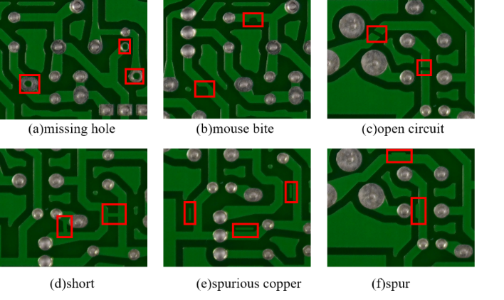

<div align="center">

# 🔌 PCB Defect Detection

**PCB 보드 결함 검출 및 객체 인식**



<br>

# 🏅 Tech Stack 🏅


</div>

<br>

## Team

|  |  |  |  |
| :--------------------------------------------------------------: | :--------------------------------------------------------------: | :--------------------------------------------------------------: | :--------------------------------------------------------------: |
| [은서](https://github.com/RohEunSeo) | [국현](https://github.com/GH-Door) | [은태](https://github.com/euntae1) | [어진](https://github.com/cuj83381-creator) |
| 팀원 | 팀원 | 팀원 | 팀원 |

<br>

## Project Overview

| 항목 | 내용 |
|:-----|:-----|
| **📅 Date** | 2026.01.12 ~ 2026.01.16|
| **👥 Type** | 팀 프로젝트 |
| **🎯 Goal** | PCB 보드 결함 실시간 검출 시스템 구축 |
| **🔧 Tech Stack** | PyTorch, YOLO, ONNX, Streamlit, OpenCV |
| **📊 Dataset** | [Kaggle PCB Defect Dataset](https://www.kaggle.com/datasets/norbertelter/pcb-defect-dataset) |

<br>

## 📋 목차

- [프로젝트 소개](#-프로젝트-소개)
- [주요 기능](#-주요-기능)
- [데이터셋 구조](#-데이터셋-구조)
- [모델 아키텍처](#-모델-아키텍처)
- [설치 방법](#-설치-방법)
- [사용 방법](#-사용-방법)
- [실험 결과](#-실험-결과)
- [프로젝트 구조](#-프로젝트-구조)

<br>

## 🎬 시연 영상

<div align="center">

### 📹 모델 추론 데모

**⬇️ 여기에 비디오 파일을 드래그 앤 드롭하세요 ⬇️**

</div>

---

## 🎯 프로젝트 소개

PCB(Printed Circuit Board) 제조 공정에서 발생하는 다양한 결함을 자동으로 검출하는 딥러닝 기반 객체 인식 시스템입니다.

### 핵심 특징
- ✅ **YOLO 기반 실시간 검출**: 빠르고 정확한 결함 탐지
- 🚀 **ONNX 경량화**: 실시간 추론을 위한 모델 최적화
- 🎨 **Streamlit 데모**: 사용자 친화적인 웹 인터페이스
- 📊 **데이터 증강**: Albumentations를 활용한 강건한 학습
- 🔬 **재현 가능한 파이프라인**: 학습/평가/추론 모듈화

<br>

## 🎯 주요 기능

### 1. 결함 검출
- Missing Hole (구멍 누락)
- Mouse Bite (모서리 결함)
- Open Circuit (개방 회로)
- Short Circuit (단락)
- Spur (돌기)
- Spurious Copper (불필요한 구리)

### 2. 모델 학습
- YOLO 기반 Object Detection
- 다양한 데이터 증강 기법
- 학습 과정 모니터링

### 3. 추론 및 배포
- ONNX 변환을 통한 경량화
- Streamlit 기반 웹 데모
- 실시간 이미지/비디오 추론

<br>

## 📊 데이터셋 구조

```
dataset/
├── raw/                    # 원본 Kaggle 데이터
│   ├── train/             # 원본 학습 데이터
│   │   ├── images/
│   │   └── labels/
│   ├── val/               # 원본 검증 데이터
│   │   ├── images/
│   │   └── labels/
│   ├── test/              # 원본 테스트 데이터
│   │   ├── images/
│   │   └── labels/
│   └── data.yaml          # YOLO 데이터셋 설정
└── aug/                    # 증강된 데이터 (Data Augmentation)
```

<br>

## 🏗️ 모델 아키텍처

- **Base Model**: YOLOv8/YOLOv11
- **Backbone**: CSPDarknet
- **Framework**: Ultralytics
- **Export Format**: ONNX Runtime

<br>

## 🛠️ 설치 방법

### 1. 저장소 클론

```bash
git clone https://github.com/PCB-object-detection/PCB.git
cd PCB
```

### 2. 의존성 설치 (uv 사용)

```bash
# uv 설치 (없는 경우)
curl -LsSf https://astral.sh/uv/install.sh | sh

# 패키지 설치
uv sync
```

### 3. Kaggle 데이터셋 다운로드

```bash
# Kaggle API 토큰 설정 (~/.kaggle/kaggle.json)
# https://www.kaggle.com/settings/account 에서 API 토큰 생성

# 데이터셋 다운로드 (자동으로 dataset/raw/에 저장됨)
python scripts/download_kaggle.py
```

<br>

## 🚀 사용 방법

### 학습

```bash
python src/training/train.py --config configs/train_config.yaml
```

### 추론

```bash
python src/inference/predict.py --weights weights/best.pt --source dataset/test
```

### ONNX 변환

```bash
python src/models/export_onnx.py --weights weights/best.pt
```

### Streamlit 데모 실행

```bash
streamlit run streamlit_app/app.py
```

<br>

## 📈 실험 결과

| Model | mAP@0.5 | mAP@0.5:0.95 | Inference Time |
|:------|:--------|:-------------|:---------------|
| YOLOv8n | - | - | - ms |
| YOLOv8s | - | - | - ms |
| YOLOv8m | - | - | - ms |

<br>

## 📁 프로젝트 구조

```
PCB/
├── dataset/              # 데이터셋
│   ├── raw/             # 원본 Kaggle 데이터
│   │   ├── train/      # 학습 데이터 (images, labels)
│   │   ├── val/        # 검증 데이터
│   │   ├── test/       # 테스트 데이터
│   │   └── data.yaml
│   └── aug/             # 증강된 데이터
│
├── src/                 # 소스 코드
│   ├── data/           # 데이터 로딩/전처리
│   ├── models/         # 모델 정의
│   ├── training/       # 학습 스크립트
│   ├── evaluation/     # 평가 스크립트
│   ├── inference/      # 추론 스크립트
│   └── utils/          # 유틸리티 함수
│
├── scripts/            # 유틸리티 스크립트
├── notebooks/          # Jupyter 노트북
├── configs/            # 설정 파일
├── weights/            # 모델 가중치
├── onnx_models/        # ONNX 모델
├── outputs/            # 추론 결과
├── streamlit_app/      # Streamlit 데모
└── tests/              # 테스트 코드
```

<br>


## 📝 License

This project is licensed under the MIT License.

---

<div align="center">
Made with ❤️ by Likelion Team
</div>
